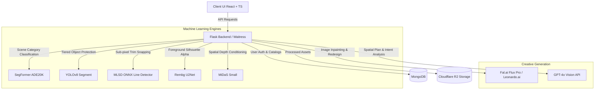
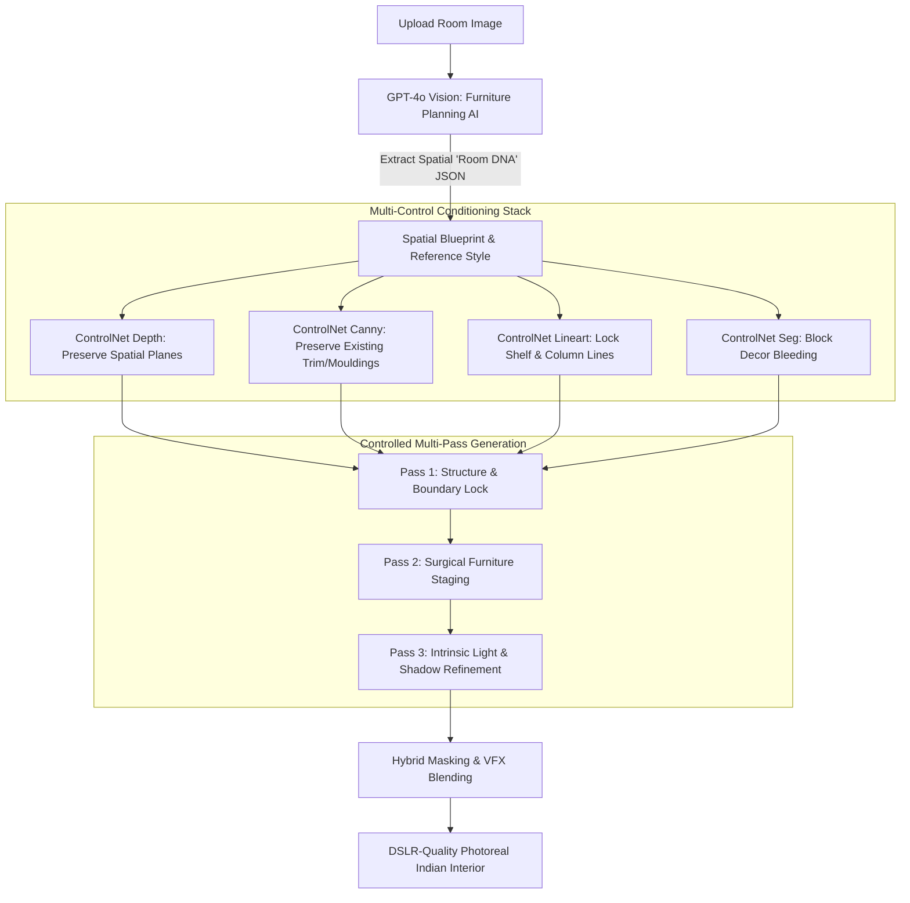

# 🏛️ Ideal AI Interior Visualizer Studio

Welcome to the **Ideal AI Interior Visualizer Studio**—a state-of-the-art, dual-engine visualizer designed to revolutionize interior design and material staging. Combining professional computer vision, advanced deep learning, and robust generative AI pipelines, this unified platform provides designers and clients with hyper-realistic, architecturally locked visual simulations.

This workspace comprises two core subsystems, powered by a unified Python/Flask backend and a premium React/TypeScript frontend:
1. **🎨 Wallpaper / Material Studio Visualizer**: A geometry-aware, 3D perspective-warping and lighting-realistic engine designed to showcase catalog wallpapers, paints, and tiles on user-uploaded walls with sub-pixel snapping and glare suppression.
2. **🤖 AI Interior Copilot**: An intelligent, conversational design partner powered by GPT-4o-vision and state-of-the-art diffusion pipelines (Flux Pro/Leonardo.ai) to surgically stage modular wardrobes, beds, TV units, and luxury decor into empty spaces without breaking existing room architecture.

---

## 🛠️ System Architecture & Tech Stack

The workspace uses a high-performance stack optimized for heavy computer vision workloads and sub-second material rendering:



### Technical Stack Components:
*   **Frontend**: React, TypeScript, Tailwind CSS, Lucide Icons, Vite.
*   **Backend**: Python, Flask, Waitress (Production WSGI), OpenCV, PyTorch.
*   **Databases & Cloud**: MongoDB (Users, PDF documents, material filters, OCR cache), Cloudflare R2 (S3-compatible scalable asset bucket).

---

## 🎨 Subsystem 1: Wallpaper & Material Studio Visualizer

The Wallpaper Visualizer delivers interactive material staging that looks **photorealistic and physically accurate**, departing from flat 2D overlays by projecting texture onto wall planes and respecting ambient scene lighting.

```mermaid
sequenceDiagram
    autonumber
    User->>Frontend: Upload Room Photo
    Frontend->>Backend: Initialize Session (/api/upload-room)
    rect rgb(30, 30, 40)
        Note over Backend: Run Parallel Computer Vision Stack:
        Backend->>SegFormer: Get Wall Categories & Protection Mask
        Backend->>YOLOv8: Extract Tiered Object Obstruction Map
        Backend->>MiDaS: Generate Room Depth Map
        Backend->>Rembg: Generate Fine Silhouette Alpha (e.g. plants)
    end
    Backend->>Backend: Fuse Assets into Session Cache (RAM)
    Backend-->>Frontend: Return Session ID
    User->>Frontend: Select Material / Crop PDF Catalog
    Frontend->>Backend: Apply Material (/api/process-wall)
    rect rgb(30, 30, 40)
        Note over Backend: Run Lighting & Warp Rendering:
        Backend->>Backend: Vanishing Point Analysis & Plane Decomposition
        Backend->>Backend: Mathematical Perspective Homography Warping
        Backend->>Backend: Intrinsic Bilateral Lighting Extraction
        Backend->>Backend: Glare Suppression & Soft Occlusion Blending
        Backend->>Backend: VFX Tone Mapping, Contrast (CLAHE), & Sharpening
    end
    Backend-->>Frontend: Return WebP Base64 Render (Sub-second Response)
```



### Key Features & Algorithms:

#### 1. Intrinsic Lighting Preservation & Dual-Scale Multiplexer
Standard overlays wash out realistic shadows. Our engine extracts the room’s native `light_field` by separating gray-level illumination using a **bilateral filter** to preserve edges. We blend the wallpaper texture using a dual-scale mix of:
*   **Multiplicative Blending**: Correctly maps deep shadows and shading contours.
*   **Soft Light Blending**: Preserves high-frequency details and micro-textures in highlights, preventing pattern washout in bright zones.

#### 2. Plane-Aware Perspective Projection (Homography)
The engine automatically structures flat wallpaper patterns along wall perspective lines:
1.  **Vanishing Point Detection**: Horizontal and diagonal lines are extracted using Hough transforms and clustered to locate architectural vanishing points.
2.  **Plane Decomposition**: Analyzes depth gradients to classify walls into dominant orientations (**Left**, **Front**, **Right**).
3.  **Warping**: Computes perspective projection matrices (homography) to mathematically skew, compress, and scale textures dynamically onto side walls.
4.  **Natural Tiling**: Automatically estimates a "Natural Scale" matching the pattern to 20% of the room's total height to prevent unrealistic stretching.

#### 3. Tiered Object Protection & Soft Occlusion
Using YOLOv8, objects are classified into dynamic safety zones to block wallpaper leakage:
*   **Critical Tier** (TVs, glass, windows, mirrors): Dilated safety bounds to enforce 100% masking lock.
*   **Medium Tier** (Sofas, beds, cabinets): 98% opacity contour wrapping.
*   **Soft Tier** (Plants, decor, pillows): Soft-feathered alpha masks utilizing `rembg` (U2Net) to preserve complex plant leaves and hair-thin edges.

#### 4. Highlight & Glare Suppression
Extreme LED spotlights or direct sunlight glare can ruin material renders. The engine maps bright highlights (top 5% luminance in LAB color space), isolates the glare zone, applies **Telea Inpainting**, and smoothly blends surrounding wall color to suppress reflections.

#### 5. Progressive PDF Catalog Extractor & Layout-Aware OCR
*   **Progressive Parser**: Large catalog PDFs are rendered and streamed page-by-page to the UI, allowing users to browse instantly while extraction continues in the background.
*   **Drag-to-Crop Staging**: Users drag selection crops to extract textures from catalog pages.
*   **Layout-Aware OCR Matcher**: Standardizes distorted model names using custom regex and spatial scoring. If a code (like `WK160-28`) is cropped, the OCR automatically scans the column **below** the selected texture, prioritizing vertical alignment to discover the correct catalog ID.
## 🤖 Subsystem 2: AI Interior Copilot (Surgical Architectural Editing Engine)

The AI Interior Copilot operates not as a text-to-image generator, but as a **Surgical, Architecture-Constrained Staging Engine**. Traditional diffusion pipelines regenerate entire scenes, altering camera angles, shifting perspectives, bending walls, and destroying built-in shelving. This engine enforces strict geometry constraints to ensure that **the original room architecture remains 100% untouched**, with edits restricted to newly installed furniture and materials.



---

### 🛡️ Strict Architectural Preservation Rules
To maintain absolute structural fidelity, the staging pipeline operates under a zero-drift constraint:

| Element | Preservation Strategy (STRICT LOCK) | What is NEVER Allowed |
| :--- | :--- | :--- |
| **Room Shell** | Keep exact wall corners, floor-to-ceiling boundaries, pillars, and ceiling shapes. | Move walls, invent hallways, or alter room dimensions. |
| **Camera View** | Maintain identical lens focal length, height, camera angle, and perspective lines. | Tilt, rotate, zoom, or shift camera coordinates. |
| **Openings** | Windows, doors, and adjacent rooms must remain structurally original. | Add fake windows, delete doors, or change window frame style. |
| **Lighting** | Lock daylight entry angles, native exposure levels, and ambient highlight positions. | Invent conflicting shadows or apply artificial CGI glow. |
| **Fixtures** | Retain existing built-in recesses, architectural mouldings, and columns. | Melt, bend, or ignore architectural borders. |

---

### 🚀 The 8-Step Controlled Staging Pipeline

Professional AI staging requires a highly coordinated computer vision and conditioning stack:

#### 1. Geometry & "Room DNA" Extraction
Before triggering diffusion, the engine constructs a spatial model representing the room's core blueprint:
```json
{
  "walls": ["left_plane", "front_plane"],
  "floor": "vitrified_tile_area",
  "ceiling": "pop_cornice_bounds",
  "built_in_cavities": [{"id": 1, "coordinates": [x1, y1, x2, y2]}],
  "protected_zones": ["windows", "doors", "existing_AC_unit"],
  "empty_editable_zones": ["center_floor", "right_wall_recess"]
}
```

#### 2. Strict Multi-Control Conditioning Lock
To prevent spatial distortion, the engine feeds the diffusion model multiple parallel conditioning layers:
*   **ControlNet Depth**: Enforces consistent 3D room coordinates and camera depth planes.
*   **ControlNet Canny**: Preserves micro-lines, window frames, and wall-moulding boundaries.
*   **ControlNet Lineart**: Snaps vertical and horizontal shelving structures, preventing slanting.
*   **ControlNet Seg**: Identifies pre-existing furniture boundaries to prevent new items from bleeding into them.

#### 3. Surgical Edit Zoning (Hybrid Masking)
Rather than passing a generic mask, the engine creates highly precise, feathered editable zones:
*   **Hard Masking (0% feathering)**: Used at strict architectural boundaries (e.g. wall/column joints) to prevent furniture from clipping into structural walls.
*   **Soft Masking (Gaussian-feathered)**: Applied along floor boundaries and around soft textiles (e.g., bedding overlays) to ensure seamless lighting and shadow harmonization.

#### 4. Cost-Optimized Professional Staging (SDXL Inpainting + ControlNet)
For professional-grade spatial accuracy without expensive cloud costs, the engine coordinates:
$$\text{SDXL Inpainting} + \text{ControlNet Depth} + \text{ControlNet Canny} + \text{IP-Adapter}$$
This combination preserves the original room shape much better than generic Flux Dev inference, while reducing processing latency to sub-second timings.

#### 5. GPT-4o-Vision "Furniture Planning AI"
The AI Intent Analyzer extracts spatial layout coordinates to generate a structured renovation plan rather than simple text:
```json
{
  "room_type": "bedroom",
  "camera_angle": "front-facing",
  "empty_wall": "right side recess",
  "wardrobe_width": "6.5ft custom built-in",
  "wardrobe_style": "matte laminate with sleek brass handles",
  "bed_position": "center aligned to primary front wall",
  "suggested_prompt": "king bed with sage green padded headboard, crisp white bedsheets, oak wood side tables"
}
```

#### 6. Multi-Pass Generation Workflow
High-fidelity staging is broken into three sequential passes to guarantee detail accuracy:
*   **Pass 1: Structure & Shell Lock**: Anchors the empty room bounds and aligns empty recesses.
*   **Pass 2: Furniture Spawning**: Synthesizes the core physical objects (beds, wardrobes) inside the editable mask coordinate boxes.
*   **Pass 3: Texture & Lighting Harmonization**: refines material gloss, metallic details on handles, fabric weaves, and casts soft ambient shadows onto surrounding floor tiles.

#### 7. Visual Style Consistency (IP-Adapter Reference Injection)
To achieve true designer fidelity, the engine supports reference image conditioning using **IP-Adapter**. Instead of generating generic cabinets, users can upload a photo of a specific finish (e.g., a exact wood grain or modular kitchen shutter) and surgically stage it onto their walls.

#### 8. Intrinsic Shadow & Lighting Harmonization
To blend staged furniture realistically, the pipeline extracts the original room's native lighting direction (using MiDaS depth and light-field gradient analysis) and casts **physically matching contact shadows** from the staged furniture onto original floors and adjacent walls, removing any floaty, animated, or CGI-like appearance.

---

### 📐 Subsystem 2 Staging Rules & Quality Controls

#### 🚪 Modular Wardrobe Rules
*   **Built-in Cavity Lock**: Convert empty wall recesses into flushed modular closets. Wardrobe doors must align perfectly with existing alcoves.
*   **Sizing & Proportions**: Shutter widths must be mathematically divided (e.g. 1.5ft to 2ft panels) and handles must be scaled relative to the door height to prevent warped, cartoonish proportions.
*   **Laminate Finishes**: Map tactile wood-grains, matte PU textures, or acrylic high-gloss reflection panels following vertical alignment lines.

#### 🛏️ Bed Placement & Scale Rules
*   **Walking Clearance**: Keep a minimum 2-foot visual walkway on both sides of the bed to preserve realistic room ergonomics.
*   **Floor Visibility**: Ensure the bed is grounded with believable contact shadows. Bed sheets must hang naturally, showing soft wrinkles and accurate drape weight.

#### 📺 TV Unit & Panel Rules
*   **Flush Wall Staging**: TV backing panels must sit perfectly parallel to the background wall perspective grid.
*   **Hidden Cable Layouts**: Preserve realistic clean wall aesthetics—never float TVs or let wires render randomly in space.

---


## 📂 Project Directory Structure

```text
├── backend/
│   ├── core/
│   │   ├── depth.py            # Depth estimation (MiDaS) & spatial zones
│   │   ├── generation.py       # Inpainting engine integrations
│   │   ├── geometry.py         # Structural line & skeleton detection (MLSD)
│   │   ├── prompt_templates.py # Styled prompts for distinct rooms
│   │   └── segmentation.py     # Scene segmentation (SegFormer & YOLOv8)
│   ├── models/
│   │   ├── mlsd_tiny_512_fp32.onnx  # ONNX Line segment model
│   │   └── yolov11n-seg.pt          # YOLO segmentation model
│   ├── app.py                  # Main Flask Server (Waitress deployment)
│   ├── main.py                 # Secondary/FastAPI sandbox entrypoint
│   ├── requirements.txt        # Python backend package checklist
│   └── .env                    # Local environment credentials
├── src/
│   ├── components/
│   │   ├── AIInteriorCopilot.tsx      # AI Copilot UI and Intent Display
│   │   ├── CustomUploadVisualizer.tsx # Wallpaper Visualizer Studio & Custom Uploads
│   │   ├── Visualizer.tsx             # Preset Material Visualizer
│   │   ├── LandingPage.tsx            # Navigation Hub
│   │   ├── AdminPanel.tsx             # Catalog upload & OCR monitor
│   │   └── Login.tsx / Signup.tsx     # Authentication interface
│   ├── App.tsx                        # Main client router
│   ├── config.ts                      # Global environment endpoints
│   └── index.css                      # Core styling rules
├── package.json                       # Client package manager config
└── readme.md                          # Main workspace documentation
```

---

## 🔌 API Route Registry

The primary endpoints served by the Flask application (`backend/app.py` running on port `5000`):

| Method | Route | Subsystem | Description |
| :--- | :--- | :--- | :--- |
| `POST` | `/api/upload-room` | Wallpaper | Uploads room, triggers concurrent CV stack, caches session. |
| `POST` | `/api/process-wall` | Wallpaper | Warps selected wallpaper onto wall. Integrates lighting & shadow blends. |
| `POST` | `/api/upload-pdf` | Catalog | Progressive PDF extractor. Uploads document and processes pages in parallel. |
| `GET` | `/api/pages` | Catalog | Progressive stream: retrieves R2 urls for processed pages. |
| `POST` | `/api/crop` | Catalog | Crops texture from catalog page and triggers Layout-Aware OCR. |
| `POST` | `/api/detect-codes` | Catalog | Fast-median-filter OCR. Scans catalog pages for codes. |
| `POST` | `/api/ai-copilot-analyze` | AI Copilot | GPT-4o-Vision deep spatial planner. Returns layout & suggested prompt. |
| `POST` | `/api/ai-copilot-generate` | AI Copilot | Runs geometry-locked Flux inpainting to redesign spatial zones. |
| `POST` | `/api/signup` | Auth | Registers a new user. Hashes password securely. |
| `POST` | `/api/login` | Auth | Validates credentials against MongoDB. |
| `GET` | `/health` | Core | Diagnostic route verifying loaded ML models & R2 status. |

---

## ⚙️ Environment Configuration

Create a `.env` file inside the `backend/` directory to configure model keys, databases, and Cloudflare R2 storage:

```env
# 🔑 Authentication & LLMs
OPENAI_API_KEY=your_openai_api_key
FAL_KEY=your_fal_ai_diffusion_key

# 🗄️ Database
MONGODB_URL=mongodb+srv://<user>:<password>@cluster.mongodb.net/
DATABASE_NAME=idealtredz

# ☁️ Cloudflare R2 Storage (S3 API compatible)
R2_BUCKET_NAME=idealtrendzzz
R2_ACCESS_KEY_ID=your_cloudflare_r2_access_key
R2_SECRET_ACCESS_KEY=your_cloudflare_r2_secret_key
R2_ACCOUNT_ID=your_cloudflare_account_id
R2_PUBLIC_URL=https://pub-xxxxxx.r2.dev

# 🌐 Server Ports
PORT=5000
```

---

## 🚀 Setup & Installation Guide

### Prerequisites
*   Node.js (v18+ recommended)
*   Python 3.10+ (with CUDA compatibility if utilizing NVIDIA GPU)

### 1. Backend Installation & Startup
Navigate into the `backend` folder:
```bash
cd backend
```

Create and activate a virtual environment:
```bash
# Windows
python -m venv venv
venv\Scripts\activate

# macOS / Linux
python3 -m venv venv
source venv/bin/activate
```

Install the dependencies:
```bash
pip install -r requirements.txt
```

Verify that the local models are stored correctly:
*   Ensure segment-anything weights are downloaded: `sam_vit_b_01ec64.pth` (The app will attempt to download this automatically on initial startup if missing).
*   Check that the ONNX line segment model is located at: `models/mlsd_tiny_512_fp32.onnx`

Start the production-ready Flask server:
```bash
python app.py
```
*The server will initialize the backend. Wait for `[DEBUG] --- All Models Loaded & Ready ---` to ensure all machine learning pipelines are warmed up in RAM.*

### 2. Frontend Installation & Startup
Open a new terminal at the root directory:
```bash
# Install package dependencies
npm install

# Run the Vite developmental server
npm run dev
```

Open your browser to `http://localhost:5173` to enter the visualizer studio dashboard!

---

## 💡 Pro Staging Guidelines & Troubleshooting

> [!NOTE]
> **Performance Optimization**: On system bootup, the Flask server initializes the neural networks asynchronously. The first upload or render might show a retry notice while models load into VRAM/RAM. Subsequent operations are sub-second.

> [!TIP]
> **Optimal AI Copilot Prompts**: For modular furniture staging, focus your prompt additions on materials and items, e.g., *"walnut finish wardrobe with premium bronze handles, low-profile tufted bed with white duvet"* instead of raw styling words like *"make it beautiful"*. The built-in GPT-4o Intent Analyzer handles the layout.

> [!IMPORTANT]
> **High-Res Wall Rendering**: For the Wallpaper Visualizer, ensure your target room upload is bright and sharp. The Guided Bilateral Filter relies on guidance edges; blurry images might cause pattern bleed at the borders of dark furniture. Use a clean DSLR or high-quality phone capture.

---

*Ideal AI Studio — Formulated with surgical precision for interior renovations.*
